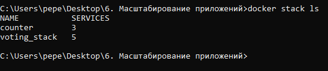
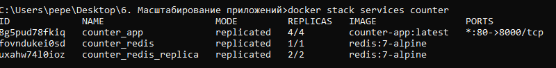
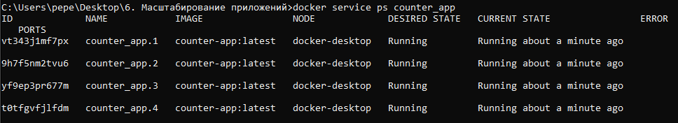
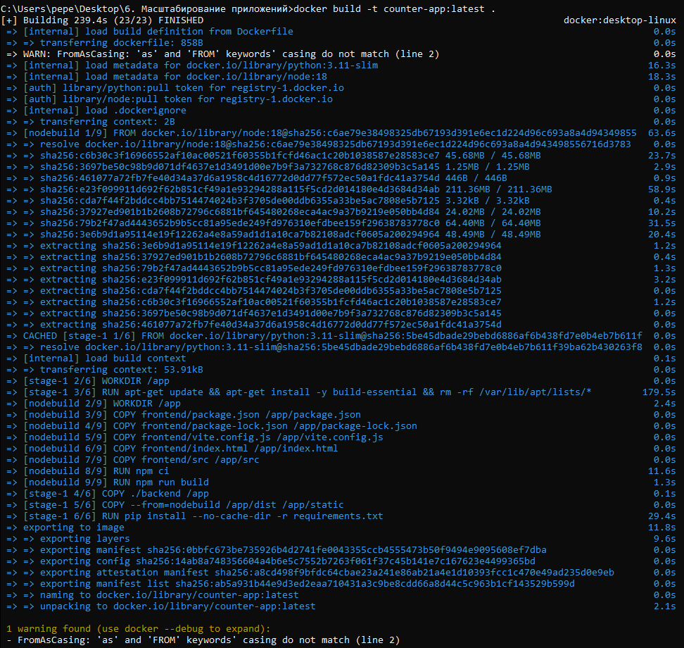
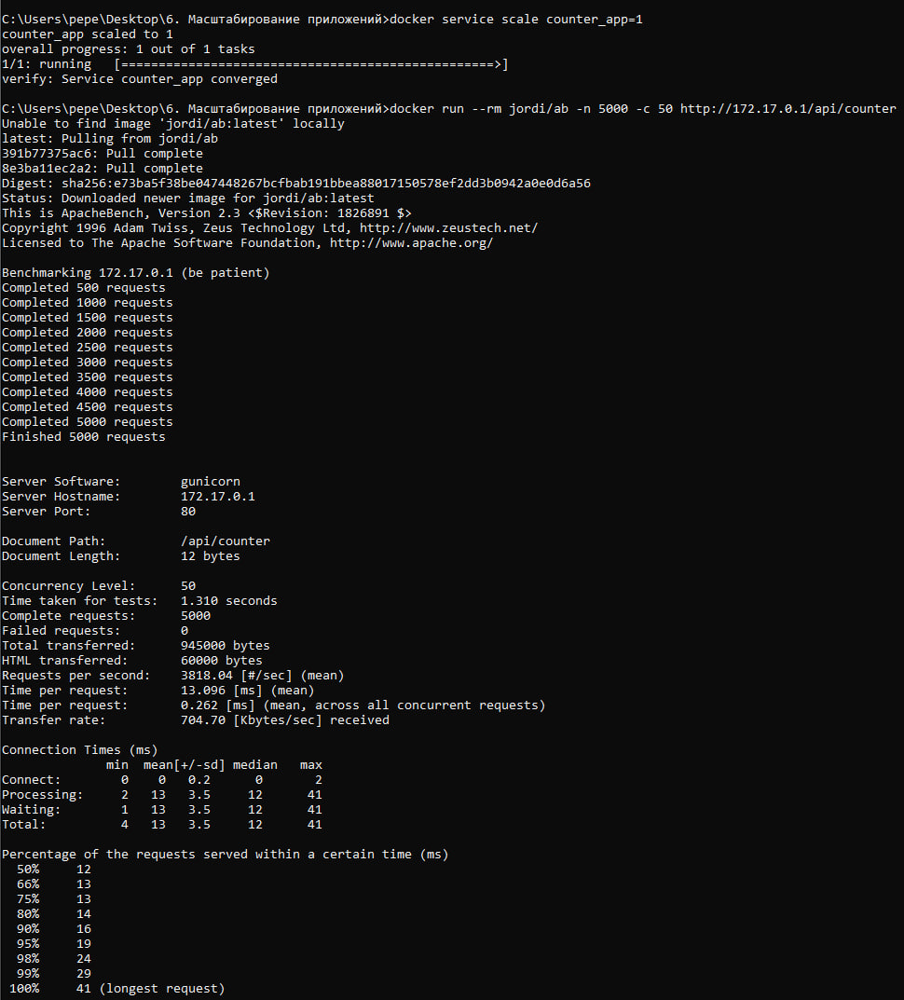
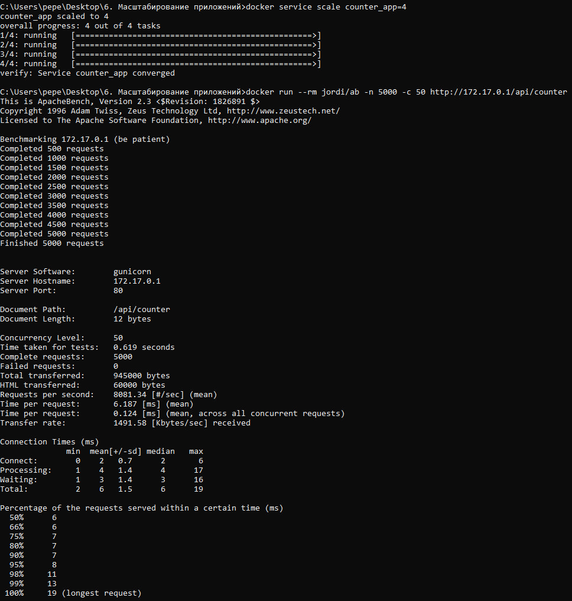

# 6. Масштабирование приложений

Репозиторий: форк `Ran3boy/counter-deploy`  
В отчете приведены выполненные пункты 2-5, ответы на вопросы и подтверждение скриншотами.

---

## 2) Docker registry for Linux Part 1

Задача: развернуть Docker Registry с внешним хранилищем и запушить туда `hello-world`, затем показать содержимое смонтированного storage.

- Registry запущен с volume на каталог `registry-data`
- Выполнены `docker pull hello-world`, `docker tag ... localhost:5000/hello-world`, `docker push ...`

**Скриншот (содержимое внешнего хранилища registry после push):**  


---

## 3) Docker registry for Linux Parts 2 & 3 — HTTPS + Basic Auth

Задача: показать подключение к registry по HTTPS и прохождение аутентификации (успешное и неуспешное).

### Подтверждение HTTPS
Проверка соединения и сертификата (TLS handshake) выполнена через `openssl s_client`.


### Аутентификация (Basic Auth)
- Неуспешная попытка (неверные учетные данные / 401 Unauthorized):  


- Успешная попытка (`Login Succeeded`):  


---

## 4) Docker Orchestration Hands-on Lab (Swarm Mode)

Задача: выполнить шаги оркестрации, показать узел в режимах **Active** и **Drain**, затем вернуть в **Active** и ответить на вопросы.

### Active (до Drain)
`docker node ls` (Availability = Active):  


Состояние сервиса `sleep-app` до Drain:  


### Перевод узла в Drain
Команда `docker node update --availability drain ...`:  


Состояние узла после Drain (Availability = Drain):  


Состояние сервиса после Drain (задачи reschedule/shutdown):  


### Возврат узла в Active
Команда `docker node update --availability active ...` и проверка:  


### Ответы на вопросы
**Вопрос:** восстановилась ли работа запущенного сервиса на этом узле?  
**Ответ:** После перевода узла в `Drain` оркестратор удаляет задачи сервиса с этого узла и (при наличии других узлов) переносит их на другие узлы. После возврата узла в `Active` задачи **не возвращаются автоматически** на этот узел — сервис продолжает работать на тех узлах, где он уже запущен, пока не произойдет пересcheduling.

**Вопрос:** что необходимо сделать, чтобы запустить работу службы на этом узле снова?  
**Ответ:**  
1) Вернуть узел в `Active`: `docker node update --availability active <node_id>`  
2) Чтобы задачи снова распределились на этот узел — выполнить перепланирование сервиса, например:
- `docker service update --force <service>` (принудительный rollout), или
- масштабирование `docker service scale ...` (изменение replicas), чтобы Swarm перераспределил задачи.

---

## 5) Swarm stack introduction (voting app)

Задача: развернуть stack из compose-файла и зафиксировать:
- как конфигурируется количество инстансов/реплик в стэке
- как организуется проверка жизнеспособности (healthcheck)

### Деплой voting stack
Список узлов:  


Deploy:  


Список стэков:  


Сервисы стэка:  


Задачи сервиса vote:  


# Кластеризованное развертывание приложения-счетчика (Flask + Redis)

## 1. Масштабирование реплик сервиса

Где `N` — желаемое число реплик (инстансов) сервиса.

## 2. Проверка жизнеспособности сервисов (Healthcheck)

Проверка состояния контейнера задается в `compose/stack` файле:

```yaml
healthcheck:
  test: ["CMD", "..."]
  interval: 10s
  timeout: 3s
  retries: 3
```

# Кластеризованный деплой приложения-счетчика (Flask)

## Обзор
Проект демонстрирует кластеризованное развертывание веб-приложения-счетчика на Flask с использованием 4 реплик в Docker Swarm. Включает сравнение производительности при различном количестве реплик и пример адаптации для Kubernetes (k3s).

### Healthcheck в Docker
Docker использует результат healthcheck для определения состояния контейнера (`healthy` / `unhealthy`).

## Структура стека в Docker Swarm

### Развертывание
Стек развертывается следующей командой:
```bash
docker stack deploy -c docker-stack.yml counter
```

# Проверка развертывания и нагрузочное тестирование

## Проверка состояния развертывания

### Список стеков
```bash
docker stack ls
```


# Документация по сервису счетчика (Docker Swarm)

## 1. Проверка статуса сервиса

### Команда проверки:
```bash
docker stack services counter
```


# Руководство по масштабированию и нагрузочному тестированию приложения Counter

## 1. Проверка состояния сервиса

### Текущий масштаб сервиса
```bash
docker service ls
```


# Лабораторная работа: Масштабирование сервиса Counter

## 1. Проверка состояния сервиса
Перед началом тестирования убедимся, что сервис `counter_app` развернут в 4 репликах.

```bash
docker service ps counter_app
```


# Нагрузочное тестирование сервиса counter

## Ожидаемый результат
4 запущенных экземпляра сервиса.

## 2. Нагрузочное тестирование: 1 реплика vs 4 реплики

### Инструмент
ApacheBench (`ab`)

### Цель тестирования
`http://172.17.0.1/api/counter`

### Прогон A: Тестирование с 1 репликой

#### Масштабирование сервиса и запуск нагрузочного теста
```bash
docker service scale counter_app=1
docker run --rm jordi/ab -n 5000 -c 50 http://172.17.0.1/api/counter
```


# Прогон B: Тестирование с 4 репликами

## Восстановление масштаба сервиса и повторный нагрузочный тест

```bash
docker service scale counter_app=4
docker run --rm jordi/ab -n 5000 -c 50 http://172.17.0.1/api/counter
```


# Тестирование и особенности масштабирования

## 3. Выводы по тестированию

*   Потенциал обработки запросов может вырасти при увеличении количества реплик Flask.
*   Итоговая производительность зависит от **узких мест системы**:
    *   CPU
    *   Сеть
    *   Производительность Redis
*   При развертывании на одной машине (Docker Desktop) масштабирование ограничено одним хостом, что может снизить потенциальный прирост производительности.

## 4. Особенности масштабирования Redis

В проекте используется **Redis** как база данных. Кластеризация возможна через отдельный сервис реплик (например, `redis_replica` с `replicas > 1`).

### Проблема репликации stateful-сервиса
Если создать сервис Redis с `replicas > 1` под одним именем:
*   Swarm будет балансировать запросы между экземплярами.
*   Это приведет к **неконсистентности данных** (значения счетчика будут "расходиться").
*   Каждый инстанс Redis хранит свои собственные данные.

### Возможные решения

1.  **Master/Replica**
    *   Запись только в мастер-узел.
    *   Чтение — с реплик.

2.  **Redis Sentinel / Redis Cluster**
    *   Использование встроенных механизмов кластеризации.
    *   Обеспечение отказоустойчивости.

3.  **Внешняя managed БД/кэш**
    *   Использование надежного внешнего хранилища.
    *   Развертывание вне Swarm (например, облачный Redis).

## 5. Адаптация для Kubernetes (k3s)

При переходе с Docker Swarm на Kubernetes используются следующие аналоги:

| Docker Swarm | Kubernetes (k3s) |
|--------------|------------------|
| `deploy.replicas` | `Deployment.spec.replicas` |

### Настройка проверок живучести
*   **livenessProbe** — перезапускает pod при "смерти" контейнера.
*   **readinessProbe** — временно убирает pod из балансировки нагрузки, пока контейнер не будет готов обрабатывать трафик.
