# 6. Масштабирование приложений — отчет

Репозиторий: форк `Ran3boy/counter-deploy`  
В отчете приведены выполненные пункты 2–5, ответы на вопросы и подтверждение скриншотами.

---

## 2) Docker registry for Linux Part 1

Задача: развернуть Docker Registry с внешним хранилищем и запушить туда `hello-world`, затем показать содержимое смонтированного storage.

- Registry запущен с volume на каталог `registry-data`
- Выполнены `docker pull hello-world`, `docker tag ... localhost:5000/hello-world`, `docker push ...`

**Скриншот (содержимое внешнего хранилища registry после push):**  


---

## 3) Docker registry for Linux Parts 2 & 3 — HTTPS + Basic Auth

Задача: показать подключение к registry по HTTPS и прохождение аутентификации (успешное и неуспешное).

### Подтверждение HTTPS
Проверка соединения и сертификата (TLS handshake) выполнена через `openssl s_client`.

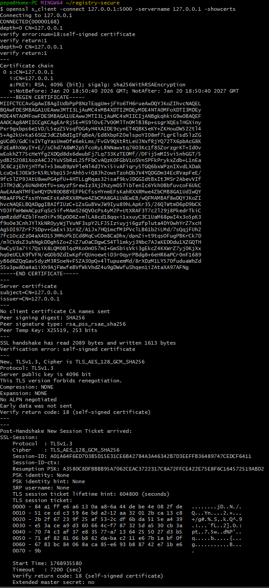

### Аутентификация (Basic Auth)
- Неуспешная попытка (неверные учетные данные / 401 Unauthorized):  
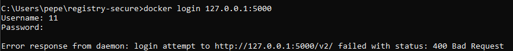

- Успешная попытка (`Login Succeeded`):  
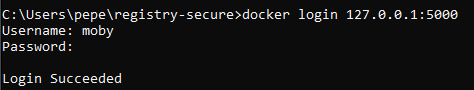

---

## 4) Docker Orchestration Hands-on Lab (Swarm Mode)

Задача: выполнить шаги оркестрации, показать узел в режимах **Active** и **Drain**, затем вернуть в **Active** и ответить на вопросы.

### Active (до Drain)
`docker node ls` (Availability = Active):  
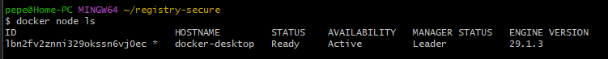

Состояние сервиса `sleep-app` до Drain:  
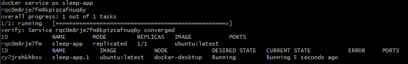

### Перевод узла в Drain
Команда `docker node update --availability drain ...`:  
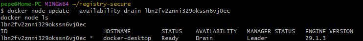

Состояние узла после Drain (Availability = Drain):  
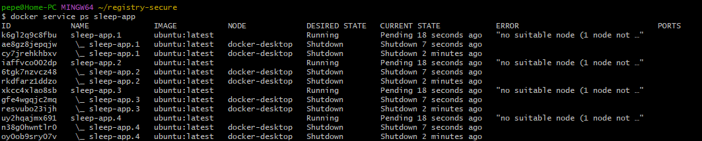

Состояние сервиса после Drain (задачи reschedule/shutdown):  
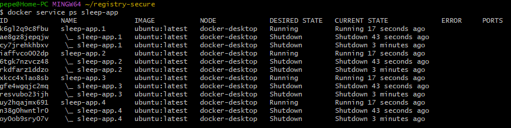

### Возврат узла в Active
Команда `docker node update --availability active ...` и проверка:  
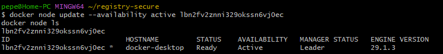

### Ответы на вопросы
**Вопрос:** восстановилась ли работа запущенного сервиса на этом узле?  
**Ответ:** После перевода узла в `Drain` оркестратор удаляет задачи сервиса с этого узла и (при наличии других узлов) переносит их на другие узлы. После возврата узла в `Active` задачи **не возвращаются автоматически** на этот узел — сервис продолжает работать на тех узлах, где он уже запущен, пока не произойдет пересcheduling.

**Вопрос:** что необходимо сделать, чтобы запустить работу службы на этом узле снова?  
**Ответ:**  
1) Вернуть узел в `Active`: `docker node update --availability active <node_id>`  
2) Чтобы задачи снова распределились на этот узел — выполнить перепланирование сервиса, например:
- `docker service update --force <service>` (принудительный rollout), или
- масштабирование `docker service scale ...` (изменение replicas), чтобы Swarm перераспределил задачи.

---

## 5) Swarm stack introduction (voting app)

Задача: развернуть stack из compose-файла и зафиксировать:
- как конфигурируется количество инстансов/реплик в стэке
- как организуется проверка жизнеспособности (healthcheck)

### Деплой voting stack
Список узлов:  
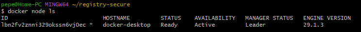

Deploy:  
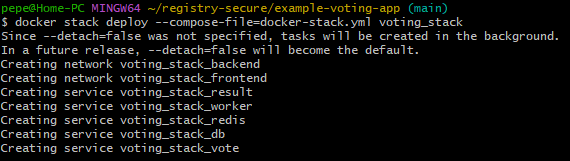

Список стэков:  


Сервисы стэка:  
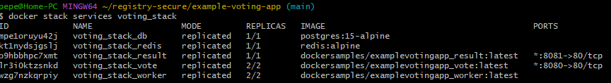

Задачи сервиса vote:  
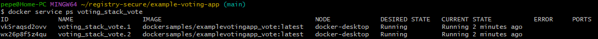

### Как конфигурируется количество инстансов (реплик) в Swarm stack
В Swarm (docker stack deploy) масштабирование сервиса задается в compose/stack файле через секцию:

```yaml
deploy:
  replicas: N
